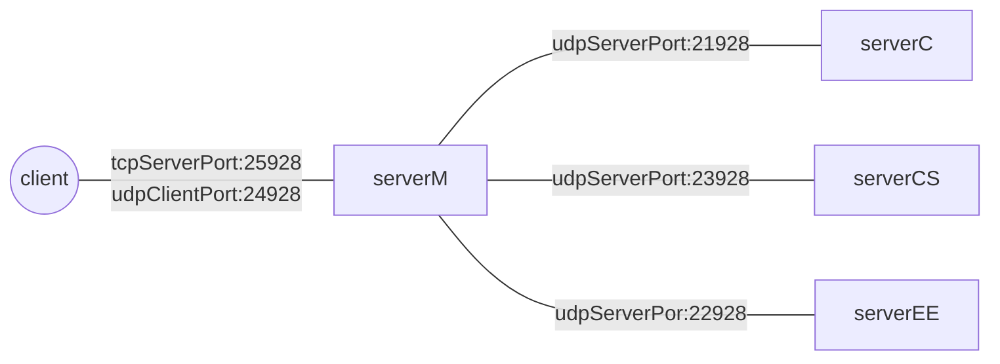


# EE450 Project

```

				Name: Kartik Hakim

				USC ID: 9520-8829-28

				Extra Credit Section : Done

```

# Project flow chart:

  



  

# What have I done in this assignment?

  

In this socket-programming project using `CPP` language, I implemented the simulation of a web registration process.

 
In this process, a client will enter the course code and category of the information he/she wishes to retrieve.


This `client` will communicate with `serverM` process, which in turn will communicate with credential (`serverC`) and *backend servers* (`serverEE`, `serverCS`) .

 
I tested all code both on my local Mac (M2 chip) and studentVM (ubuntu 16).

  
  

# Comments
>  Idiosyncrasies of the project

Please keep following suggestions in mind while testing:

  

1.  **Please prefer reading from readme.html**.

  

2. If while testing client is stopped or gets stuck, please **restart** all processes, it should start working fine.

  

3. Please make sure course-ids are inputted in the syntax mentioned in ***How to run the programs*** section

  

4. If while testing, authentication is failing, please restart client, serverM and serverC.

  

5. If `serverM` exits with following error

  

```

libc++abi: terminating with uncaught exception of type std::out_of_range: basic_string

zsh: abort ./serverM

```

  

Please **restart**  `client` , `serverC`and `serverM` processes.

6. Sometimes the I/O  buffers will not read properly, so the messages will not be printed properly on the console.
```
james sent a request to the main server.
The client received the response from the Main server using TCP over port 52446.
.he CourseName of EE450 is Introduction to Computer Networks
```

```
The ServerEE received a request from the Main Server about the CourseName of EE450.
The course information has been found: The CourseName of EE450 is Introduction to . mputer Networks
The ServerEE finished sending the response to the Main Server.
```
It should get fixed by restarting all 5 processes.

## How to run the programs
  

Please start the 5 processes in following format:-

1. First open 5 different terminal window instances.

  

2. Use one terminal and type `make all` to compile all the cpp files.

  

```

ee450_hakim_kartik_9520882928 % make all

g++ -std=c++11 -shared-libgcc serverM.cpp -o serverM

g++ -std=c++11 -shared-libgcc serverC.cpp -o serverC

g++ -std=c++11 -shared-libgcc serverEE.cpp -o serverEE

g++ -std=c++11 -shared-libgcc serverCS.cpp -o serverCS

g++ -std=c++11 -shared-libgcc client.cpp -o client

ee450_hakim_kartik_9520882928 %

```

  
  

3. Start the processes in following order

<br/>

Terminal 1: `./serverEE`

  

Terminal 2: `./serverCS`

Terminal 3: `./serverC`

Terminal 4: `./serverM`

Terminal 5: `./client`

4. Input syntax in terminal 1, for client process:

  

* While entering username and password:

  

```

ee450_hakim_kartik_9520882928 % ./client

The client is up and running.

  

Please enter the username: james

Please enter the password: Th!r3oe4s

james sent an authentication request to the main server.

james received the result of authentication using TCP over port 51750. Authentication failed: Password does not match.

Attempts remaining: 2

  

Please enter the username: amber

Please enter the password: cOntra4@positiv1e

amber sent an authentication request to the main server.

amber received the result of authentication using TCP over port 51759. Authentication failed: Password does not match.

Attempts remaining: 1

  

Please enter the username: james

Please enter the password: 2kAnsa7s)

james sent an authentication request to the main server.

james received the result of authentication using TCP over port 51767. Authentication is successful

```

  
  

* While entering single course-ids

```

Please enter the course code to query: EE450

Please enter the category(Credit / Professor / Days / CourseName): Days

james sent a request to the main server.

The client received the response from the Main server using TCP over port 51767.

The Days of EE450 is Tue;Thu

```

  
  

* While entering multiple course-ids

```

Please enter the course code to query: EE450 CS100 EE520

james sent a request to the main server.

The client received the response from the Main server using TCP over port 52001.

CourseCode: Credits, Professor, Days, Course Name

EE450: 4,Ali Zahid,Tue;Thu,Introduction to Computer Networks

CS100: 4,Sathyanaraya Raghavachary,Tue;Thu,Explorations in Computing

EE520: 4,Todd Brun,Tue;Thu,Introduction to Quantum Information Processing

```

  

**Incorrect way of input**

  

* DO NOT ENTER UNEXPECTED SPACES

* END ALL LINES USING NEWLINE CHARACTERS

```

Please enter the course code to query: EE450 CS100

EE520

james sent a request to the main server.

The client received the response from the Main server using TCP over port 52029.

CourseCode: Credits, Professor, Days, Course Name

EE450: 4,Ali Zahid,Tue;Thu,Introduction to Computer Networks

CS100: 4,Sathyanaraya Raghavachary,Tue;Thu,Explorations in Computing

EE520: 4,Todd Brun,Tue;Thu,Introduction to Quantum Information Processing

```

```

Please enter the course code to query: EE450

  
  
  
  
  
  

EE520

james sent a request to the main server.

The client received the response from the Main server using TCP over port 52030.

CourseCode: Credits, Professor, Days, Course Name

EE450: 4,Ali Zahid,Tue;Thu,Introduction to Computer Networks

EE520: 4,Todd Brun,Tue;Thu,Introduction to Quantum Information Processing

  

-----Start a new request-----

  

Please enter the course code to query:

```

  

## Implementations
>  What your code files are and what each one of them does
  
 
#### `client`

  
The workflow of `client` is as follows:

1. client process start a **TCP** socket and uses a dynamically assigned port number.

2. Enter the username and password.

3. The given username and password (say u1,p1), are appended in a string template `username:<u1>,password:<p1>`.

4. This template is sent via TCP to `serverM`.

5. The serverM checks with `serverC` and responds, via TCP, one of the following strings as response:
		*  `Username not found`
		*  `Username found, Password didnt match`
		* `Username verified`
		* `Not sure`


6. If the response is `Username verified`, client will expect to read course and category and code will move to steps 7-10.

If the response is not `Username verified`, steps 1-6 will be repeated.

7. User will enter course code and category(expected values are `Credit` / `Professor` / `Days` / `CourseName` ), say c1 and c2.

8. Will create a string template `course:<c1>,category:<c2>` and send to serverM via TCP.

9.  `serverM` will check with respective backend servers, via **UDP**, and responds either with the requested information (if the course-code is present in DB) or with string `NO_DATA` (if the course-code is not present in DB).

10. client will process the response from serverM, via **TCP**, and print appropriate messages on the console.

  

##
### `serverM`

  

The workflow of `serverM `is as follows:

  

1. serverM expects to receive a string template of format `username:<u1>,password:<p1>` from client via **TCP** over port **25928**.

2.  `serverM` extracts the username, `u1` and password, `p1` from the template and encrypts them.

3. The encrypted username and password, say `e1` and `e2`, are sent to `serverC` via **UDP** over port **24928**.

4.  `serverC` replies, via **UDP**, with one of the following strings:
		*  `Username not found`
		*  `Username found, Password didnt match`
		* `Username verified`
		* `Not sure`

5.  `serverM` forwards these response from `serverC` to `client`, via **TCP**.

6. If the `serverC`, response is `Username verified`, a flag is set, to expect course-category string template, from `client`.

7. Once the flag is set, `serverM` receives client-category template from client.

8.  `serverM` will extract course and category, say `c1` and `c2`, and based on the first 2 characters of course `c1` will choose appropriate *backend servers*.

9.  `serverM` will send the string template `course:<c1>,category:<c2>` to *backend servers* (`serverCS` or `serverEE`) via **UDP** over port, **24928**.

10. Once `serverM` receives the response, it forwards it to client, via **TCP** over port **25928**.

##
#### `serverC`

  

The workflow of `serverC` is as follows:

  

1.  `serverC` expects a string containing `u1,p1` via **UDP** over port **21928**.

2.  `serverC` reads the txt file `cred.txt` and stores in a global map variable.

3. Once we receive the string, we extract `u1` and `p1` and look for `u1` as a **key** in the global map.

4. If `u1` is found in the map, we check `p1` is similar to password stored in map.

5. Based on both the comparison, a string response is selected:
		*  `Username not found`
		*  `Username found, Password didnt match`
		* `Username verified`
		* `Not sure`

6. This string response is replied back to `serverM`.

  
  
##

#### `serverCS/EE`

  
  

The workflow of backend servers (`serverEE`/`serverCS`) is as follows:

  

1.  `serverEE/CS` expects a string containing `course:<c1>,category:<c2>` via **UDP** over port **23928(serverEE)** or port **22928(serverCS)** from `serverM`.

2.  `serverEE/CS` reads the txt file `ee.txt` (serverEE) or `cs.txt` (serverCS) and stores in 4 global map variables (*credit / professor name/ course name / credits*).

3. Once we receive the string, we extract course id, `c1`, and course category, `c2`.

4. Based on `c2`, category, we select the appropriate map variable, search for course id `c1`, and store the response as string.

5. If course code is not found, we set the response to `NOT_FOUND`.

6. We reply back the response to `serverM`.

7. For **extra credit section**, I set <u>category to `everything` and read information from all 4 global variable maps and append them in the response variable </u>.

  ## Message Formats

  |code |UserName / Password | CourseCategory
|:--------:| -------------:|-------------:|
| client      | `username:u1,password:p1` |`course:c1,category:c2`|
| serverM      | `username:eU1,password:eP1` |`course:c1,category:c2`| 
|serverC     | `username:eU1,password:eP1` | NA| 
|serverCS    | NA |`c1,c2`|
|serverEE    | NA |`c1,c2`|

where:
u1 : username entered on client terminal 
p1 : password enter on client terminal
eU1: encrypted username sent by serverM to serverC
eP1 : encrypted password sent by serverM to serverC
c1 : course id entered on client terminal sent by client to serverM to backend servers
c2 : course category entered on client terminal by client to serverM to backend servers

## Reused Code

  
  

* [Beej]( https://beej.us/guide/bgnet/pdf/bgnet_usl_c_1.pdf )

  

For example

<br/>from section 6.5:-

```

int sockfd, rv, numbytes;

  

struct addrinfo hints, *servinfo, *p;

  

struct sockaddr_storage their_addr;

  

  

socklen_t addr_len;

  

char s[INET6_ADDRSTRLEN];

  

memset(&hints, 0, sizeof hints);

  

hints.ai_family = AF_INET6;

  

hints.ai_socktype = SOCK_DGRAM;

  

//hints.ai_flags = AI_PASSIVE; // use my IP

  

hints.ai_flags = INADDR_ANY; // using localhost as IP

  

if ((rv = getaddrinfo(NULL, MY_UDP_PORT, &hints, &servinfo)) != 0)

  

{

  

fprintf(stderr, "getaddrinfo: %s\n", gai_strerror(rv));

  

exit(2);

  

}

  

  

// loop through all the results and bind to the first we can

  

for (p = servinfo; p != NULL; p = p->ai_next)

  

{

  

if ((sockfd = socket(p->ai_family, p->ai_socktype, p->ai_protocol)) == -1)

  

{

  

perror("serverEE : socket");

  

continue;

  

}

  

  

if (::bind(sockfd, p->ai_addr, p->ai_addrlen) == -1)

  

{

  

close(sockfd);

  

perror("bind failed in serverEE, will try another socket");

  

continue;

  

}

  

  

break;

  

}

  

  

if (p == NULL)

  

{

  

fprintf(stderr, "bind failed in serverEE\n");

  

exit(2);

  

}

  

  

freeaddrinfo(servinfo);

```

  

* [LinuxHowTo](https://www.linuxhowtos.org/C_C++/socket.htm)

For example:-

```

read(newsockfd,buffer,255)

```

```

if (connect(sockfd,&serv_addr,sizeof(serv_addr)) < 0)

error("ERROR connecting");

```

  

* [GeeksForGeeks](https://www.geeksforgeeks.org/socket-programming-cc/)

```

int sockfd = socket(domain, type, protocol) ;

  

int bind(int sockfd, const struct sockaddr *addr, socklen_t addrlen) ;

  

int new_socket= accept(int sockfd, struct sockaddr *addr, socklen_t *addrlen);

```

  

* [TutorialsPoint](https://www.tutorialspoint.com/parsing-a-comma-delimited-std-string-in-cplusplus )

  

```

vector<string> result;

  

stringstream s_stream(my_str); //create string stream from the string

while (s_stream.good())

  

{

string substr;

getline(s_stream, substr, ','); //get first string delimited by comma

result.push_back(substr);

}

  

```

  

* [StackOverflow](https://stackoverflow.com/questions/216823/how-to-trim-an-stdstring)

  

```

void ltrim(string &s) {

  

s.erase(s.begin(), find_if(s.begin(), s.end(), [](unsigned char ch) {

  

return !std::isspace(ch);

  

}));

  

}

  

  

// trim from end (in place)

  

void rtrim(string &s) {

  

s.erase(find_if(s.rbegin(), s.rend(), [](unsigned char ch) {

  

return !std::isspace(ch);

  

}).base(), s.end());

  

}

  

  

// trim from both ends (in place)

  

void trim(string &s) {

  

ltrim(s);

  

rtrim(s);

  

}

```

## Extra files

  

* `stringUtil.h` : custom header file having string trimming code for given input string.

* `codec.h` : custom header having encryption / decryption code for credential verification.
